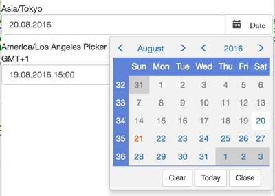
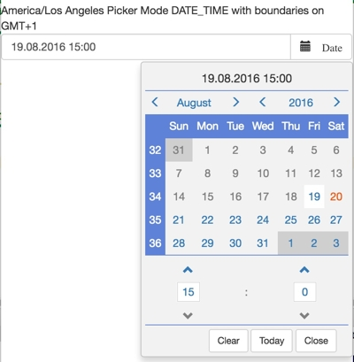
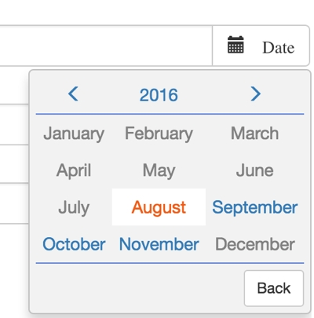
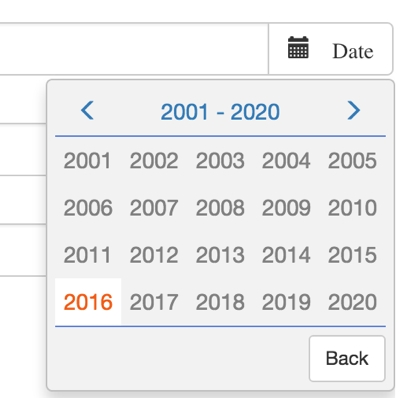

# angular-bootstrap-picker
Bootstrap date picker with timezone support for angular 1.5.x


 | 
:-------------------------:|:-------------------------:
 | 

## Introduction

Why another date picker? There are myriads of date pickers on the net, so why another one?
The answer is simple, I could not find even one which was able to handle timezones the way I need it and which was in a state where
fixing it would take less time than writing my own picker.

My main goal is to keep the code in a clean maintainable state and to cover just my corner case.
If it fits your use cases then feel free to use my date picker, it is under the most liberal license there is (MIT license).
If it does not fit then feel free to extend it and send a patch. However bare in mind. I do not intend to
cover every corner case on earth with this picker. I prefer to do one thing and do it correctly. Which is date picking
with timezone support. 

### So what does the component exactly do?

* It allows you to pick time and dates with javascript Date objects.
* It allows you to set the component to a timezone and pattern no matter where you are located.
* The component is optimized for clean code and easy navigation to make the selection progress as easy as possible.
* You can set upper and lower DateTime boundaries, which are reflected in the correct time and date of the timezone selected.


### What it does not do (at the moment)

* Localisation (you can localize to some degree via moment which is used internally however)
* AM/PM timeformat at the moment the component allows only the 24 hours timeformat

Both things might be added in the future if the need arises or someone provides a proper patch.
(Patches and collaboration are always welcome)


## Installation

Installation via bower

```
bower install werpu/angular-bootstrap-picker --save
```

## Demo

A live demo can be found in the demo folder or on
https://werpu.github.io/angular-bootstrap-picker/demo/

## Usage

You simply can use the date picker like every other angular module. Once imported

```javascript

    angular.module('App', ['werpu.bootstrap.picker'])

```


```html
    <date-picker name="europe" ng-model="currentDate"
                 start-date="minDate" end-date="maxDate" timezone="Europe/Zurich">
    </date-picker>
```

The date picker has following dependencies which must be loaded upfront

* bootstrap (with it jquery)
* angular 1.5.x+
* momentjs
* moment-timezone
* moment-range


Following attributes are available:

* ng-model {required} the model of the date picker, must be an object of type Date
* start-date {optional} the lower bound of the possible pick values (must be of type date=
* end-date {optional} the upper bound of the possible pick values (must be of type date=
* timezone {optional} the moment timezone which should be used for the current picker, if not set the browsers timezone is used per default
* date-format {optional} the moment date format for the dates, if not set DD.MM.YYYY is used per default
* placeholder {optional} placeholder for the input
* name {optional} form name
* picker-mode {optional} allowed values DATE or DATE_TIME if no value is set DATE is used automatically
* button-label {optional} label for the picker button
* pickerOnlyMode {"SINGLE_BUFFERED" | "DOUBLE_BUFFERED"} if this is set, the date picker is shown in picker only mode, SINGLE_BUFFRED means that the selection
is instantly reflected in the model. DOUBLE_BUFFERED means a set button has to be pressed to update the model.
* endOfDay {optional:boolean} if a new date is picked the end of day is returned automatically (do not mix this with pickermode DATE_TIME)

#Building

The picker was programmed to 100% in typescript, to generate the javascripts following tasks have to be performed

## Before the first build

```
npm install
```

Installs all your needed modules for building the picker

## Building the javascript files
```
npm run build
```


Generates the js and css files in the dist folder out of the typescript sources.

The typescript sources are located in src/typescript.


